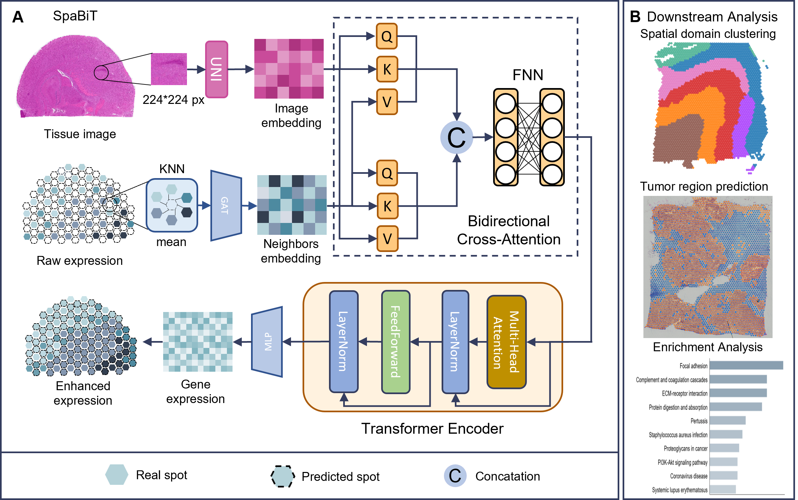

# SpaBiT: Enhancing Spatial Transcriptomics Resolution via Bidirectional Attention Transformers
## Introduction
Motivation: Spatial transcriptomics (ST) enables the precise mapping of gene expression within tissue architecture,however its application is often limited by low spatial resolution and sparse sampling. While existing deep learning methods leverage histology images, spatial coordinates, or low-resolution expression data to predict high-density profiles, these methods are limited in either capturing the intrinsic constraints between histological context andspatial topology or ignoring the complex local neighborhood relationships between spots.
Result: To address these limitations, we propose SpaBiT, a multimodal framework designed to enhance STresolution via a bidirectional attention mechanism. At its core, SpaBiT employs a bidirectional cross-attention
module to facilitate precise information exchange between image features and neighborhood-aware representations learned via a graph attention network. This design explicitly models the synergistic constraints between local morphology and spatial graph topology, yielding high-fidelity, high-density gene expression maps. SpaBiT exhibits competitive performance in reconstructing complex spatial gene expression, outperforming the benchmark models utilized in this study across various quantitative metrics, providing a robust tool for deciphering complex tissue microenvironments.



## Requirements
All experiments were conducted on an NVIDIA RTX 4090 GPU. Before running SpabiT, you need to create a conda environment and install the required packages:
```shell
conda create -n SpaBiT python==3.9
conda activate SpaBiT
pip install -r requirements.yml
```

## Data
12 dorsolateral prefrontal cortex (DLPFC) sections:   <http://spatial.libd.org/spatialLIBD>

Mouse brain sagittal posterior (MBSP):   <https://www.10xgenomics.com/datasets/mouse-brain-serialsection-1-sagittal-posterior-1-standard-1-1-0>

Human cervical cancer (HCC):   <https://www.10xgenomics.com/datasets/human-cervical-cancer-1-standard>

Human intestine cancer (HIC):   <https://www.10xgenomics.com/datasets/human-intestine-cancer-1-standard>

Mouse placenta (MP):   <https://codeocean.com/capsule/9820099/tree/v1>

Human squamous cell carcinoma (HS):  <https://pmc.ncbi.nlm.nih.gov/articles/PMC7391009/>

The Visium HD human breast cancer（HBCHD）: [https://www.10xgenomics.com/datasets/visium-hd-cytassist-gene-expression-human-breast-cancer-fresh-frozen](https://www.10xgenomics.com/datasets/visium-hd-cytassist-gene-expression-human-breast-cancer-fresh-frozen).

The Visium HD mouse brain（MBHD）: [https://www.10xgenomics.com/datasets/visium-hd-cytassist-gene-expression-mouse-brain-fresh-frozen](https://www.10xgenomics.com/datasets/visium-hd-cytassist-gene-expression-mouse-brain-fresh-frozen).

Human liver (HL), Xenium Human Multi-Tissue & Cancer Panel:   <https://www.10xgenomics.com/datasets/human-liver-data-xenium-human-multi-tissue-and-cancer-panel-1-standard>

Human Breast Cancer（BC） https://www.10xgenomics.com/datasets/human-breast-cancer-block-a-section-1-1-standard-1-0-0.

The HER2-positive breast cancer datasets: [https://github.com/almaan/her2st](https://github.com/almaan/her2st).

All preprocessed data used in this work are available at: [https://zenodo.org/uploads/15233992](https://zenodo.org/records/18044067).

## Pre-trained general-purpose foundation mode
Given the outstanding performance of large pre-trained general-purpose foundation models in clinical tasks, we use UNI as the backbone feature extractor. Before using SpaBiT, you need to apply to UNI for permission to access the model weights: [https://huggingface.co/mahmoodlab/UNI](https://huggingface.co/mahmoodlab/UNI).

## Training and Inferring
- First, preprocess histology images into fixed-size patches and generate the list of highly variable genes by running [`process_patch.py`](process_patch.py).
- Second, compute graph-based neighborhood embeddings for all spots by running [`train_gat.py`](train_gat.py).
- Finally, train SpaBiT and evaluate its spatial gene expression prediction performance by running [`main.py`](main.py).
```shell
python process_patch.py --directory dataset\\
python train_gat.py --directory dataset\\ --epochs 3000
python main.py --directory dataset\\ --epochs 1000
```
`--directory` represents the directory of your dataset, and `--login` represents the key of the UNI model you own.

## Contact details
If you have any questions, please contact 2528076418@qq.com.

